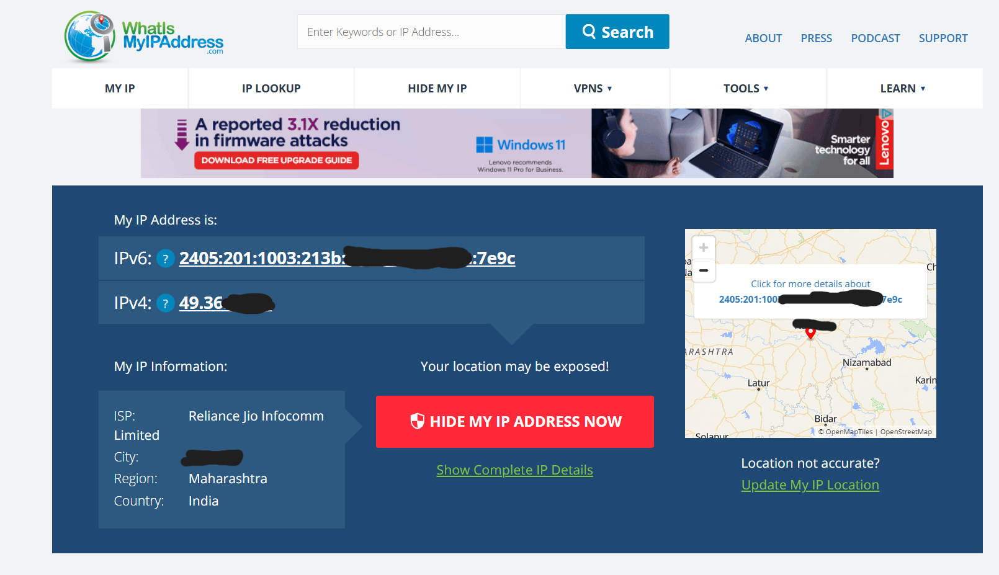
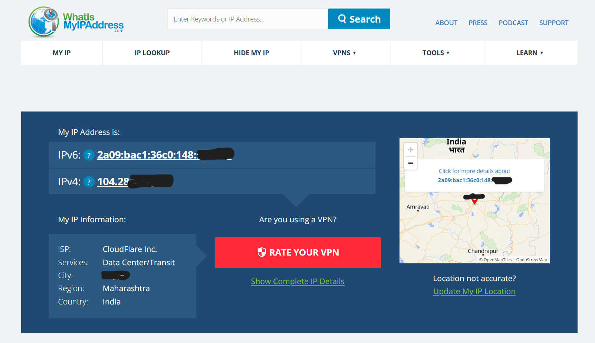

# Cybersecurity-Internship-Task-8
A report and verification for the Cyber Security Internship Task 8: Working with VPNs.

# Task 8: Working with VPNs

### Objective
The objective of this task was to understand the role of VPNs in protecting privacy and securing communication.

### Tool Used
* **VPN Client:** Cloudflare WARP

---

## 1. VPN Setup Steps

I used Cloudflare WARP for this task. The setup steps are as follows:

1.  **Download:** Downloaded the Cloudflare WARP client from its official website (`1.1.1.1`).
2.  **Install:** Installed the application on my local system.
3.  **Connect:** Opened the application and clicked the connection toggle button to activate the VPN to a "Connected" state.
4.  **Verify:** To verify the connection, I visited `whatismyipaddress.com` to check if my IP address had changed.

---

## 2. Connection Status Verification

To verify the VPN connection, I took screenshots before and after connecting to the VPN.

### Screenshot 1 (VPN Disconnected)

This screenshot shows my original IP address, assigned by my Internet Service Provider (Reliance Jio Infocomm).

### Screenshot 2 (VPN Connected)

After connecting to Cloudflare WARP, my IP address changed, and the ISP is now listed as "CloudFlare Inc." This confirms that my traffic is being routed through the VPN.

---

## 3. VPN Benefits and Limitations

### Benefits

* **Privacy:** A VPN hides your real IP address, which helps prevent websites and trackers from monitoring your activity.
* **Encryption:** It encrypts (locks) your internet traffic. This is crucial on public Wi-Fi (like in cafes or airports) to prevent hackers from stealing your data.
* **Bypass Censorship:** A VPN can allow you to access websites or content that might be blocked in your country or on your local network.

### Limitations

* **Speed:** Due to the encryption process, a VPN can sometimes reduce your internet speed.
* **Trust:** A VPN provider (especially a free one) could potentially log your activity. It's important to use a reputable VPN that has a strict no-logs policy.
* **No Complete Anonymity:** A VPN does not make you completely anonymous. It enhances your privacy, but you can still be identified if you log into websites or services.

---

### Outcome
This task provided hands-on experience with VPNs and a better understanding of privacy tools.
